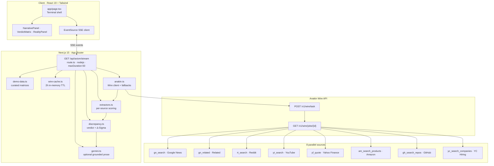

<h1 align="center">Axiom</h1>

<p align="center">
  <strong>Narrative vs. ground truth — in one forensic view.</strong><br/>
  Eight parallel Anakin Wire sources · Server-Sent Events · Rule-based Δ-Sigma · Evidence on every card
</p>

<p align="center">
  <a href="https://axiom-gold-three.vercel.app/"></a>
  <a href="https://github.com/Aasritha6/axiom"></a>
  <a href="https://anakin.io"></a>
</p>

<p align="center">
  <a href="https://axiom-gold-three.vercel.app/">axiom-gold-three.vercel.app</a>
</p>

---

## Table of contents

- [Overview](#overview)
- [What judges see on the live app](#what-judges-see-on-the-live-app)
- [Example analyses](#example-analyses)
- [System architecture](#system-architecture)
- [Request lifecycle](#request-lifecycle)
- [Anakin Wire integration](#anakin-wire-integration)
- [Scoring & verdict engine](#scoring--verdict-engine)
- [Gemini narrative layer](#gemini-narrative-layer)
- [Resilience & performance](#resilience--performance)
- [Tech stack](#tech-stack)
- [Project structure](#project-structure)
- [Quick start](#quick-start)
- [Deployment](#deployment)
- [Hackathon context](#hackathon-context)
- [License](#license)

---

## Overview

Markets and media run on stories. Operations run on facts. **Axiom** quantifies the gap between them.

Given any company or product name, Axiom dispatches **eight parallel [Anakin Wire](https://anakin.io) scrapers**—four narrative (news, related coverage, Reddit, YouTube) and four reality (Yahoo Finance, Amazon, GitHub, YC hiring)—scores each source with **transparent, reproducible rules**, and streams results to a Bloomberg-style terminal. The output is a forensic verdict, a **Δ-Sigma divergence gauge**, per-wire evidence links, and optional AI prose that is **grounded only on structured wire facts**.

**Design principle:** *Rules decide, LLM narrates.* Verdict class, risk level, signal gap, and Δ-Sigma are computed in `lib/discrepancy.ts` without any LLM. Gemini Flash (`lib/gemini.ts`) may rewrite the explanation for live scans when `GEMINI_API_KEY` is set—it never chooses the verdict or invents counts.

Built for the **Anakin Build-a-thon** · Next.js 15 · TypeScript · Vercel

---

## What we see on the live app

| Experience | Behavior |
|------------|----------|
| **First load** | Cursor curated matrix auto-runs after 500ms — verdict panel is never empty |
| **Terminal layout** | Narrative Matrix (left) · Forensic Synthesis / Δ-Sigma (center) · Reality Atomizer (right) |
| **Featured queries** | Byju's, Cursor, Humane AI Pin, Tesla FSD, WeWork — each with **📦 CACHED** (instant) and **⚡ RUN LIVE** (full Wire pipeline) |
| **RUN LIVE** | Primary green CTA; clears view, skeleton cards, pulsing **● LIVE** badge, streams wire-by-wire, ends with **✓ Scan complete** |
| **Source cards** | Signal (↑/↓/→), status badge (`LIVE` / `WIRE CACHE` / `FALLBACK` / `CACHED`), metrics, summary, **View source →** |
| **Verdict panel** | Verdict label, risk, confidence, Δ-Sigma gauge, narrative vs reality momentum bars, signal gap, forensic synthesis with **AI-grounded** or **Rule-based** badge |
| **Mobile** | Verdict matrix stacks above narrative/reality columns on viewports under `lg` |

---

## Example analyses

| Target | Narrative signal | Reality signal | Typical verdict |
|--------|------------------|----------------|-----------------|
| **Cursor** | ~18 news articles, quiet press | 340+ GitHub repos, 89 YC hiring cos | **REALITY EXCEEDS HYPE** — underweighted gem |
| **Byju's** | Peak edtech hype, 480+ article volume | Insolvency trajectory, layoffs | **HYPE DOMINATES REALITY** |
| **Humane AI Pin** | Influencer launch frenzy | Flat commits, ~2★ reviews, hiring freeze | **HYPE DOMINATES REALITY** |
| **Tesla FSD** | Autopilot breakthrough headlines | Mixed finance + repo activity | **NARRATIVE DEVIATION** |
| **WeWork** | Peak unicorn narrative | Bankruptcy, valuation collapse | **HYPE DOMINATES REALITY** |

Curated matrices live in `lib/demo-data.ts`. **Run Live** executes the full Wire path with cache bypass (`live=1`).

---

## System architecture

### High-level diagram



### Layer responsibilities

| Layer | Module(s) | Responsibility |
|-------|-----------|----------------|
| **Presentation** | `app/page.tsx`, `components/*` | 12-column terminal grid, featured carousel, SSE consumer, live/cached UX |
| **Transport** | `app/api/axiom/stream/route.ts` | ReadableStream SSE encoder, mode routing (demo / cache / live) |
| **Wire client** | `lib/anakin.ts` | Task dispatch, job polling (20× @ 1.5s), rate-limit handling, Reddit JSON + Yahoo Chart fallbacks |
| **Extraction** | `lib/extractors.ts` | Readable-text keyword scan, structured finance/GitHub/Amazon/hiring parsers, evidence URL harvest |
| **Verdict** | `lib/discrepancy.ts` | Signal-count decision tree, weighted Δ-Sigma, `buildForensicExplanation()` fallback prose |
| **Narration** | `lib/gemini.ts` | Facts JSON → structured JSON output → citation validation → URL stripping |
| **Evidence** | `lib/evidence.ts` | Primary wire URLs + search-page fallbacks for **View source →** |
| **Cache** | `lib/wire-cache.ts` | Per-query per-slug Map, 2-hour TTL (serverless-safe, in-process) |
| **Config** | `lib/config/sources.ts`, `config/wire-actions.json` | Catalog-verified action IDs, ticker aliases, param builders |

### ASCII reference (deployment view)

```
┌─────────────────────────────── VERCEL ───────────────────────────────┐
│  Static/SSR UI          │  Node.js API Route (60s max)              │
│  axiom-gold-three       │  /api/axiom/stream?query=&demo=&live=1     │
└────────────┬────────────┴──────────────────┬─────────────────────────┘
             │ EventSource (SSE)               │
             ▼                                 ▼
┌──────────────────────── Browser ─────────────────────────────────────┐
│  ◈ Header: query · RUN LIVE · ● LIVE · featured demos               │
│  ┌ Narrative ─┐ ┌ Verdict / Δ-Sigma ┐ ┌ Reality ─────────────────┐ │
│  │ 4 wires    │ │ gauge · signals    │ │ 4 wires                   │ │
│  └────────────┘ └────────────────────┘ └───────────────────────────┘ │
│  Status bar: wire progress · scan complete · errors                  │
└────────────────────────────────────────────────────────────────────┘
             │
             ▼
┌──────────────────────── Anakin Wire ─────────────────────────────────┐
│  NARRATIVE          REALITY                                            │
│  gn_search          yf_quote (+ Yahoo Chart fallback)                  │
│  gn_related         am_search_products                                   │
│  rt_search (+ Reddit JSON fallback)  gh_search_repos                    │
│  yt_search          yc_search_companies                                │
└────────────────────────────────────────────────────────────────────────┘
```

---

## Request lifecycle

```
1. User submits query OR picks featured demo (cached / live)
2. GET /api/axiom/stream?query=…&demo=cursor&live=1
3. Branch:
   ├─ demo + !live  → stream curated cards from demo-data.ts (~2s staged)
   └─ live or no demo → Promise.allSettled(8 wire tasks)
4. Per wire: cache check → POST task → poll job → extract → wire_resolved SSE
5. Aggregate results → calculateWeightedDelta + calculateVerdict
6. enrichVerdictExplanation (rule-based prose)
7. If GEMINI_API_KEY: buildGeminiFacts → synthesizeNarrative → validate citations
8. final_verdict SSE → client renders gauge + synthesis → ✓ Scan complete
```

### SSE event protocol

| Event | Payload | When emitted |
|-------|---------|--------------|
| `status` | `{ message: string }` | Routing, cache hits, per-wire progress, Gemini step, completion |
| `wire_resolved` | `{ wireId, label, category, signal, sentiment, metrics, volume, summary, isLive, isFallback, fromWireCache, evidenceLinks }` | Source succeeded |
| `wire_failed` | `{ wireId, label, category, message }` | Source threw; scan continues |
| `final_verdict` | `{ verdictLabel, riskLevel, signalGap, confidence, narrative, reality, weightedDelta, explanation, aiExplanation, narrativeMode, isCached }` | All tasks settled |
| `error` | `{ message }` | Fatal (empty query, stream panic) |

Client implementation: `EventSource` in `app/page.tsx` with listeners per event type; cards append to narrative or reality state by `category`.

---

## Anakin Wire integration

All eight `actionId` values were verified against `GET /v1/wire/catalog/{slug}`. Refresh with `npm run catalog`.

| Hemisphere | UI label | Action ID | Catalog slug | Fallback |
|:-----------|:---------|:----------|:-------------|:---------|
| **Narrative** | Google News Search | `gn_search` | `google_news` | — |
| **Narrative** | Related Coverage | `gn_related` | `google_news` | — |
| **Narrative** | Reddit Search | `rt_search` | `reddit` | Reddit public JSON API |
| **Narrative** | YouTube Search | `yt_search` | `youtube` | — |
| **Reality** | Yahoo Finance Quote | `yf_quote` | `yahoo_finance` | Yahoo Chart API |
| **Reality** | Amazon Products | `am_search_products` | `amazon` | — |
| **Reality** | GitHub Repos | `gh_search_repos` | `github` | — |
| **Reality** | YC Hiring Companies | `yc_search_companies` | `ycombinator` | — |

**Wire client details** (`lib/anakin.ts`):

- Auth: `X-API-Key` header from `ANAKIN_API_KEY`
- Flow: `POST https://anakin.io/v1/wire/task` → poll `GET /v1/wire/jobs/{job_id}` until completed or failed
- Fault isolation: each wire wrapped in try/catch inside `Promise.allSettled` — one failure never aborts the scan
- Ticker resolution (`guessTicker`): alias map (e.g. `tesla` → `TSLA`), uppercase symbols, or first 4 chars

---

## Scoring & verdict engine

### Per-source extraction (`lib/extractors.ts`)

1. **`collectReadableText()`** — Recursively walks Wire JSON; scores only human-readable fields (titles, descriptions, bodies), never raw key names.
2. **Keyword matcher** — Hype lexicon (narrative hemisphere), stress + growth lexicon (reality); word-boundary regex.
3. **Structured parsers** — Finance: price-change %; GitHub: repo count + stars; Amazon: lowest rating; YC: company count tiers.
4. **Volume amplification** — High narrative volume boosts hype score only when keywords are present.
5. **Signal threshold** — `score > 0.12` → **BULLISH** · `score < −0.12` → **BEARISH** · else **NEUTRAL**

### Δ-Sigma (weighted divergence)

```
avgN  = volume-weighted mean(narrative sentiments)
avgR  = volume-weighted mean(reality sentiments)
Δ-Sigma = clamp((avgN × 0.6) − (avgR × 1.4), −2, +2)
```

Reality sources can score positive (strong GitHub, good ratings, hiring)—pulling Δ-Sigma toward the reality side. Reality is weighted **1.4×** vs narrative **0.6×** to reflect operational signal strength.

| Δ-Sigma | Interpretation |
|:--------|:---------------|
| > +0.5 | Narrative significantly ahead of reality |
| −0.5 to +0.5 | Equilibrium |
| < −0.5 | Reality significantly ahead of narrative |

### Decision tree (`lib/discrepancy.ts`)

Requires **≥2 resolved sources per hemisphere**; otherwise **INSUFFICIENT DATA**.

| Condition | Verdict | Risk |
|-----------|---------|------|
| High narrative volume + weak reality traction | **HYPE DOMINATES REALITY** | EXTREME |
| Low narrative volume + strong reality traction | **REALITY EXCEEDS HYPE** | UNDERVALUED |
| Narrative bullish count > reality bullish + 1 | **NARRATIVE DEVIATION** | MODERATE |
| Otherwise | **CONSENSUS ALIGNED** | LOW |

**Signal gap** (secondary metric) = narrative bullish count − reality bullish count — discrete and auditable alongside Δ-Sigma.

---

## Gemini narrative layer

| Concern | Implementation |
|---------|----------------|
| **Who decides the verdict?** | Always `calculateVerdict()` + `enrichVerdictExplanation()` — never the LLM |
| **When Gemini runs** | Live Wire scans only, when `GEMINI_API_KEY` is set; curated demos use rule-based prose |
| **Input** | Strict `facts` JSON: query, rule verdict, Δ-Sigma, signal gap, per-source metrics, URLs, snippets |
| **Output** | JSON `{ headline, body, citations: [{ claim, sourceIndex }] }` |
| **Guards** | System prompt: facts-only; temperature ≤ 0.2; citation index validation; unknown URLs stripped |
| **Fallback** | API/parse/validation failure → `buildForensicExplanation()` with specific counts and wire IDs |
| **UI** | Badge: **AI-grounded narrative** vs **Rule-based fallback** |

---

## Resilience & performance

| Pattern | Where | Why |
|---------|-------|-----|
| `Promise.allSettled` | `stream/route.ts` | Parallel wires; partial failure isolation |
| `wire_failed` events | SSE | Failed card renders red; user can **RETRY SCAN** |
| 2-hour wire cache | `wire-cache.ts` | Faster repeat queries; fewer API credits |
| Reddit JSON fallback | `anakin.ts` | When `rt_search` fails |
| Yahoo Chart fallback | `anakin.ts` | When `yf_quote` fails |
| Demo mode | `demo-data.ts` | Zero-latency judging path; Cursor auto-load |
| `maxDuration = 60` | Vercel route | Accommodates 8 parallel polls (~30–60s typical) |
| Evidence fallbacks | `evidence.ts` | Every card gets a verifiable **View source →** URL |

---

## Tech stack

| Layer | Technology |
|-------|------------|
| Framework | Next.js 15 (App Router), React 19, TypeScript |
| Styling | Tailwind CSS v4 — phosphor green terminal theme |
| Transport | Server-Sent Events (`text/event-stream`) |
| Data plane | Anakin Wire API (`X-API-Key`) |
| Scoring | Rule-based extractors — no ML, no LLM-per-source |
| Prose | Google Gemini 2.0 Flash (optional, grounded) |
| Deploy | Vercel — `runtime = "nodejs"` on stream route |

---

## Project structure

```
axiom/
├── app/
│   ├── page.tsx                      # Terminal shell, EventSource, auto Cursor demo
│   ├── globals.css                   # Terminal theme (Courier, CRT scanlines)
│   └── api/axiom/stream/route.ts     # SSE orchestrator
├── components/
│   ├── VerdictMatrix.tsx             # Δ-Sigma gauge, verdict, synthesis badge
│   ├── NarrativePanel.tsx / RealityPanel.tsx
│   ├── SourceCard.tsx                # Metrics, signals, View source →
│   ├── FeaturedCarousel.tsx          # CACHED vs RUN LIVE per demo
│   ├── DeltaSigmaGauge.tsx
│   ├── WireSkeletonCard.tsx
│   └── StatusBar.tsx
├── lib/
│   ├── anakin.ts                     # Wire task + poll + fallbacks
│   ├── extractors.ts                 # Per-source sentiment + evidence
│   ├── discrepancy.ts                # Verdict tree + Δ-Sigma + rule prose
│   ├── gemini.ts                     # Grounded narrative synthesis
│   ├── evidence.ts                   # URL builders for attribution
│   ├── demo-data.ts                  # Curated matrices (5 targets)
│   ├── wire-cache.ts                 # In-memory 2h cache
│   └── config/sources.ts             # 8-wire registry + ticker aliases
├── config/wire-actions.json          # Verified action IDs
└── scripts/
    ├── recon.js                      # Smoke-test all 8 wires
    └── fetch-catalog.js              # Catalog discovery
```

---

## Quick start

**Prerequisites:** Node.js 18+ · [Anakin API key](https://anakin.io) · optional [Gemini key](https://aistudio.google.com/apikey)

```bash
git clone https://github.com/Aasritha6/axiom.git
cd axiom
npm install
cp .env.example .env.local
```

`.env.local`:

```env
ANAKIN_API_KEY=your_anakin_key
GEMINI_API_KEY=your_gemini_key   # optional — enables AI-grounded prose on live scans
```

```bash
npm run dev      # http://localhost:3000
npm run build    # production build
npm run recon -- --test "Cursor"   # smoke-test all 8 wires
npm run catalog                    # refresh Wire catalog JSON
```

---

## Deployment

1. Import [github.com/Aasritha6/axiom](https://github.com/Aasritha6/axiom) on [Vercel](https://vercel.com).
2. Set environment variables: `ANAKIN_API_KEY`, `GEMINI_API_KEY`.
3. Deploy — no extra config required.

The SSE route runs on Node.js with `maxDuration = 60`. Live scans typically complete in **30–60 seconds** across eight parallel sources.

**Live:** [axiom-gold-three.vercel.app](https://axiom-gold-three.vercel.app/)

---

## Hackathon context

**Anakin Build-a-thon** — Axiom demonstrates production-grade Wire integration with a problem statement judges can feel immediately: *does the story match the substance?*

| Criterion | How Axiom delivers |
|-----------|-------------------|
| **Idea (40%)** | Quantifies narrative vs. ground truth with auditable Δ-Sigma and split-brain sourcing — not another opaque sentiment score |
| **Execution (30%)** | Eight catalog-verified Wire actions, SSE streaming, resilient fallbacks, Gemini with anti-hallucination guards, terminal UX with live/cached distinction |
| **Impact (30%)** | Actionable for investors, journalists, and researchers auditing hype (Byju's, Humane) or finding undervalued traction (Cursor) |

**Differentiators for reviewers:**

- Transparent decision tree — trace any verdict to per-source signals and volumes
- Evidence stack — every card links to source material
- Real Wire path — **RUN LIVE** streams actual API results, not just demos
- Rules decide, LLM narrates — scoring integrity preserved even when Gemini is enabled

---
## Production Hardening Roadmap

While Axiom is optimized for high-performance delivery in a demo environment, transitioning this terminal into a commercial enterprise tier would involve the following architectural upgrades:

1. **Persistent Global Caching (Redis / Vercel KV):** The current implementation utilizes an aggressive 2-hour in-memory cache layer (`lib/wire-cache.ts`). Moving this state to a distributed cache like Upstash Redis would preserve cache hits across serverless cold starts and minimize redundant billing costs on downstream Anakin Wire pipelines.
2. **Token-Bucket Rate Limiting:** To prevent malicious key exhaustion of the underlying scraping infrastructure, protect the `/api/axiom/stream` SSE route via an edge middleware rate-limiter using Vercel KV.
3. **Deterministic Unit Testing:** While `npm run recon` provides an integration smoke test for live endpoints, a comprehensive Jest/Vitest suite covering `lib/extractors.ts` and `lib/discrepancy.ts` would ensure total parsing immutability against format drift in raw wire responses.
4. **Data Calibration & Parameter Tuning:** The narrative/reality weights ($W_i=0.6$, $W_j=1.4$) and semantic keyword thresholds ($0.12$) are based on empirical historical backtesting of legendary hype collapses (e.g., WeWork, Humane). Future iterations will introduce automated calibration using historical market cap divergence datasets.
---

## License

MIT · [Aasritha](https://github.com/Aasritha6) · [Anakin.io](https://anakin.io)

<p align="center">
  <sub>The story and the substance are rarely the same.</sub>
</p>
