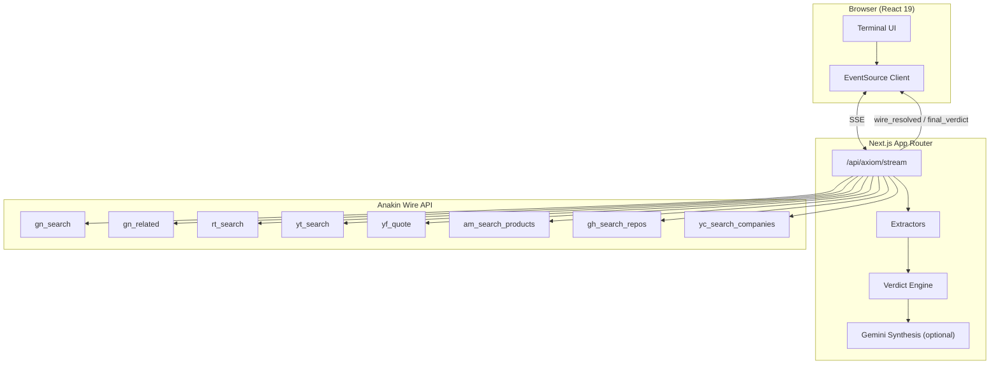
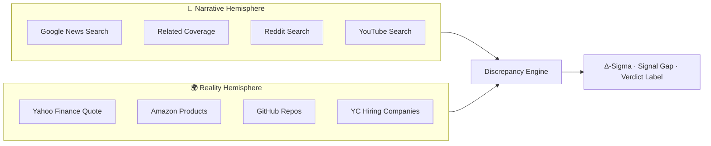

<p align="center">
  <strong>◈ AXIOM</strong><br/>
  <em>Narrative vs. Ground Truth — Forensic Intelligence Terminal</em>
</p>

<p align="center">
  Built for the <a href="https://anakin.io">Anakin.io</a> Build-a-thon · Next.js 15 · Anakin Wire · Server-Sent Events
</p>

---

## About

**Axiom** is a real-time forensic intelligence terminal that quantifies the gap between **public narrative** (media, social, video hype) and **operational reality** (finance, commerce, code, hiring). Given any company or product name, Axiom dispatches eight parallel [Anakin Wire](https://anakin.io) scrapers, scores each data source independently, and produces a auditable verdict: whether story exceeds substance, or substance exceeds story.

The interface is inspired by Bloomberg terminals — pure black, monospace typography, high information density — designed for analysts, investors, and researchers who need evidence-backed divergence metrics, not another opaque sentiment score.

---

## The Problem

Markets and media operate on two disconnected layers:

| Layer | What it captures | Typical sources |
|-------|------------------|-----------------|
| **Narrative** | Promotional language, viral coverage, influencer amplification | News, Reddit, YouTube |
| **Reality** | Transactional execution, hiring, code activity, market data | Finance APIs, Amazon, GitHub, job boards |

Existing tools either aggregate sentiment into a single opaque number, or display raw feeds without synthesis. **Axiom** splits the internet into two hemispheres, scores each source with reproducible rules, and exposes the divergence as a first-class metric — **Δ-Sigma**.

---

## What Makes Axiom Different

| Capability | Typical sentiment dashboard | Axiom |
|------------|----------------------------|-------|
| Data sourcing | Single API or manual copy-paste | **8 parallel Anakin Wire actions** with fallbacks |
| Scoring | Black-box ML or LLM-per-source | **Rule-based keyword extraction** on readable text fields only |
| Transparency | One combined score | **Per-source LIVE / CACHED / FAILED badges** + evidence URLs |
| Verdict | Subjective summary | **Signal-count decision tree** + weighted **Δ-Sigma gauge** |
| Narration | Required LLM credits | **Optional Gemini synthesis**; core math runs without any LLM |
| Demo reliability | Depends on live API uptime | **Curated demo matrices** + 2-hour Wire cache + live mode toggle |

Axiom does not ask users to trust a model. It shows what each wire returned, how it was scored, and why the verdict follows.

---

## Architecture

### System overview



### Split-brain data model



### Request lifecycle

1. **Query intake** — User submits a target (e.g. `Byju's`, `Cursor`, custom text).
2. **Parallel dispatch** — Eight Wire tasks POST to `https://anakin.io/v1/wire/task`; results polled via `/v1/wire/jobs/{id}`.
3. **Extraction** — Each payload passes through source-specific extractors. Sentiment is derived from keyword density on **title, body, description** fields — never raw JSON keys.
4. **Aggregation** — Signal counts (`BULLISH` / `BEARISH` / `NEUTRAL`) feed a decision tree; weighted Δ-Sigma is computed for the gauge.
5. **Streaming** — Results emit over SSE as `wire_resolved` events; final `final_verdict` includes optional Gemini prose.
6. **Caching** — Successful Wire responses cache in-memory for 2 hours (serverless-safe). Curated demo matrices bypass Wire for instant presentation.

---

## Anakin Wire Integration

All eight Wire action IDs were verified against the Anakin catalog (`GET /v1/wire/catalog/{slug}`).

| Hemisphere | Label | Action ID | Catalog |
|:-----------|:------|:----------|:--------|
| Narrative | Google News Search | `gn_search` | google_news |
| Narrative | Related Coverage | `gn_related` | google_news |
| Narrative | Reddit Search | `rt_search` | reddit |
| Narrative | YouTube Search | `yt_search` | youtube |
| Reality | Yahoo Finance Quote | `yf_quote` | yahoo_finance |
| Reality | Amazon Products | `am_search_products` | amazon |
| Reality | GitHub Repos | `gh_search_repos` | github |
| Reality | YC Hiring Companies | `yc_search_companies` | ycombinator |

Public fallbacks (Reddit JSON, Yahoo Finance chart) activate automatically when a Wire action fails, preserving partial results rather than aborting the scan.

---

## Verdict Engine

### Per-source scoring

Each Wire response is reduced to a discrete signal:

- **BULLISH** — promotional keyword density above threshold (narrative sources)
- **BEARISH** — stress keyword density above threshold (reality sources)
- **NEUTRAL** — no keyword match (default; avoids false-positive hype bias)

Keywords use word-boundary matching on extracted text only (`collectReadableText`), preventing false triggers from JSON field names like `future_price`.

### Δ-Sigma metric

```
avgN  = mean(narrative source sentiments)
avgR  = mean(reality source sentiments)
Δ-Sigma = (avgN × 0.6) − (avgR × 1.4)
```

| Δ-Sigma range | Verdict |
|:--------------|:--------|
| > +0.5 | **HYPE DOMINATES REALITY** |
| −0.5 to +0.5 | **CONSENSUS ALIGNED** |
| < −0.5 | **REALITY EXCEEDS HYPE** |

The UI renders Δ-Sigma on a −2 to +2 gauge with a glowing position indicator. A separate **signal gap** (narrative bullish count minus reality bullish count) provides a discrete, auditable secondary metric.

### Optional synthesis

When `GEMINI_API_KEY` is configured, Gemini Flash generates a concise forensic summary ending with `ESTIMATED RISK EXPOSURE: [figure]`. The verdict math remains rule-based regardless of LLM availability.

---

## Interface

Axiom presents a 12-column terminal grid:

| Region | Role |
|--------|------|
| **Left panel** | Narrative Matrix — live cards for news, social, related, YouTube |
| **Center panel** | Forensic Synthesis — Δ-Sigma gauge, verdict label, signal bars, copy button |
| **Right panel** | Ground Reality Atomizer — finance, Amazon, GitHub, hiring |
| **Header** | Source counter (`8 sources · N live · N resolved`) |
| **Carousel** | Featured queries with **Cached** and **Run Live** modes |

Each source card displays: signal direction, status badge (`LIVE` · `WIRE CACHE` · `FALLBACK` · `FAILED`), metric rows, and up to three **View source →** evidence links.

---

## Example Analyses

| Target | Narrative signal | Reality signal | Typical verdict |
|--------|------------------|----------------|-----------------|
| **Byju's** | 480 peak articles, national edtech hype | $22B → insolvency, 10k+ layoffs | Hype dominates |
| **Cursor** | Quiet coverage (18 articles) | 340 GitHub repos, 89 hiring companies | Reality exceeds |
| **Humane AI Pin** | Influencer launch frenzy | Flat commits, 2.1★ reviews, hiring freeze | Hype dominates |
| **WeWork** | Peak unicorn narrative | Bankruptcy, valuation collapse | Hype dominates |

These scenarios ship as curated demo matrices for instant playback; the same pipeline runs live against Anakin Wire when **Run Live** is selected.

---

## Tech Stack

| Component | Technology |
|-----------|------------|
| Framework | Next.js 15 (App Router), React 19, TypeScript |
| Styling | Tailwind CSS v4 |
| Real-time transport | Server-Sent Events (SSE) |
| Data layer | Anakin Wire API (`X-API-Key` auth) |
| Scoring | Rule-based extractors (`lib/extractors.ts`) |
| Verdict logic | Signal-count tree + weighted Δ-Sigma (`lib/discrepancy.ts`) |
| Prose layer | Google Gemini Flash (optional) |
| Cache | In-memory Map, 2-hour TTL |

---

## Getting Started

### Prerequisites

- Node.js 18+
- [Anakin API key](https://anakin.io)
- [Gemini API key](https://aistudio.google.com/apikey) (optional)

### Installation

```bash
git clone https://github.com/Aasritha6/axiom.git
cd axiom
npm install
cp .env.example .env.local
```

Configure environment variables in `.env.local`:

```env
ANAKIN_API_KEY=<anakin-api-key>
GEMINI_API_KEY=<gemini-api-key>
```

### Development

```bash
npm run dev
```

Application runs at `http://localhost:3000`.

### Production

```bash
npm run build
npm start
```

### Utility commands

```bash
npm run recon -- --test "Byju's"   # Smoke-test all 8 Wire actions
npm run catalog                    # Fetch Anakin Wire catalog
```

---

## Deployment

Axiom is a standard Next.js application and deploys to [Vercel](https://vercel.com) without additional configuration.

1. Import the repository from GitHub (`Aasritha6/axiom`).
2. Set environment variables `ANAKIN_API_KEY` and `GEMINI_API_KEY` in the project settings.
3. Deploy.

The SSE route is configured with `runtime = "nodejs"` and `maxDuration = 60` for long-running Wire polls. Live scans typically complete in 30–60 seconds across eight parallel sources.

---

## Project Structure

```
axiom/
├── app/
│   ├── page.tsx                    # Terminal shell + EventSource client
│   ├── layout.tsx
│   └── api/axiom/stream/route.ts   # SSE orchestrator
├── components/
│   ├── VerdictMatrix.tsx           # Δ-Sigma gauge, verdict display
│   ├── NarrativePanel.tsx            # Left hemisphere
│   ├── RealityPanel.tsx            # Right hemisphere
│   ├── FeaturedCarousel.tsx        # Demo query selector
│   ├── SourceCard.tsx              # Per-wire result card
│   ├── FailedWireCard.tsx          # Error state card
│   ├── DeltaSigmaGauge.tsx         # Visual divergence meter
│   └── WireSkeletonCard.tsx          # Streaming placeholder
├── lib/
│   ├── anakin.ts                   # Wire client + fallbacks
│   ├── extractors.ts               # Sentiment + evidence extraction
│   ├── discrepancy.ts              # Verdict engine
│   ├── demo-data.ts                # Curated demo matrices
│   ├── gemini.ts                   # Optional LLM synthesis
│   ├── wire-cache.ts               # In-memory response cache
│   └── config/sources.ts           # Wire source registry
├── config/wire-actions.json        # Verified action IDs
└── scripts/
    ├── recon.js                    # Wire smoke tests
    └── fetch-catalog.js            # Catalog discovery
```

---

## License

MIT License — Anakin Build-a-thon 2026.

---

<p align="center">
  <strong>Axiom</strong> — because the story and the substance are rarely the same.<br/>
  Built by <a href="https://github.com/Aasritha6">Aasritha</a> · Powered by <a href="https://anakin.io">Anakin.io Wire</a>
</p>
