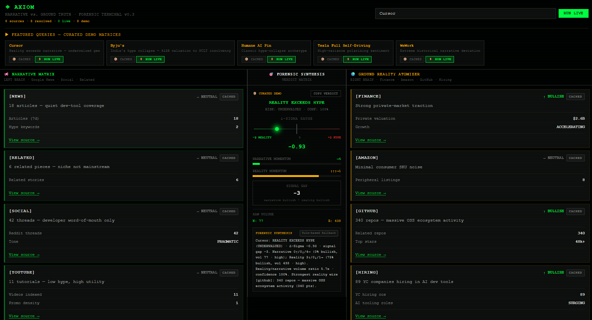

<p align="center">
  <strong>◈ AXIOM</strong><br/>
  <em>Narrative vs. Ground Truth — Forensic Intelligence Terminal</em>
</p>

<p align="center">
  Built for the <a href="https://anakin.io">Anakin.io</a> Build-a-thon · Next.js 15 · Anakin Wire · Server-Sent Events
</p>

<p align="center">
  <a href="https://axiom-gold-three.vercel.app/">Live Demo</a> ·
  <a href="https://github.com/Aasritha6/axiom">GitHub</a>
</p>

---

## Live Demo & Submission

| Resource | Link |
|----------|------|
| **Live app** | https://axiom-gold-three.vercel.app/ |
| **Repository** | https://github.com/Aasritha6/axiom |
| **Demo video** | `YOUR_VIDEO_URL` _(add your Loom/YouTube link before judging)_ |

### Screenshot



_Add `screenshot.png` at repo root (desktop) and a mobile capture for judges — placeholders OK until you capture._

### Mobile

On viewports under `lg`, the **Verdict Matrix** panel stacks **above** the narrative/reality columns so judges see the forensic synthesis first on phones. Test on a narrow viewport before submitting.

### Judging criteria alignment

| Criterion | Weight | How Axiom addresses it |
|-----------|--------|-------------------------|
| **Idea** | 40% | Quantifies narrative vs. ground truth with auditable Δ-Sigma and split-brain sourcing — not another opaque sentiment score |
| **Execution** | 30% | Eight parallel Anakin Wire actions, SSE streaming, resilient fallbacks, Gemini-grounded prose with anti-hallucination guards |
| **Impact** | 30% | Useful for investors, journalists, and researchers auditing hype cycles (Byju's, Humane, WeWork) and undervalued traction (Cursor) |

### Submission checklist

- [ ] Live demo loads and auto-runs **Cursor** curated matrix on first visit
- [ ] **RUN LIVE** hits Anakin Wire + Gemini (set `ANAKIN_API_KEY` + `GEMINI_API_KEY` on Vercel)
- [ ] Demo video URL replaced in this README (`YOUR_VIDEO_URL`)
- [ ] `screenshot.png` (+ optional mobile screenshot) added
- [ ] Social post published; link pasted in [Social proof](#social-proof) below
- [ ] No secrets committed — only `.env.example` in git

### Strengths (judge feedback)

- **Transparent scoring** — per-source signals, metrics, and evidence links on every card
- **Anakin Wire** — eight catalog-verified actions with cache, fallbacks, and fault isolation
- **SSE streaming** — cards arrive wire-by-wire; terminal UX with LIVE indicator
- **Resilience** — partial failures never kill the scan; rule-based verdict always computed

---

## Social proof

Share your build tonight (template — customize and post):

**LinkedIn / X template**

> Built **Axiom** for the @AnakinBuildathon — a Bloomberg-style terminal that compares promotional narrative vs operational reality across 8 live data wires (news, Reddit, YouTube, finance, Amazon, GitHub, YC hiring).
>
> Rule-based verdict + Δ-Sigma gauge. Gemini narrates *only* from structured wire facts — no invented numbers.
>
> 🔗 Live: https://axiom-gold-three.vercel.app/
> 📂 Code: https://github.com/Aasritha6/axiom
>
> #Buildathon #AnakinWire #NextJS

**Your post URL:** `YOUR_SOCIAL_POST_URL`

---

## About

**Axiom** is a real-time forensic intelligence terminal that quantifies the gap between **public narrative** (media, social, video hype) and **operational reality** (finance, commerce, code, hiring). Given any company or product name, Axiom dispatches eight parallel [Anakin Wire](https://anakin.io) scrapers, scores each data source independently with reproducible rules, and produces an auditable verdict: whether story exceeds substance, or substance exceeds story.

The interface is inspired by Bloomberg terminals — pure black, monospace typography, high information density — designed for analysts, investors, and researchers who need evidence-backed divergence metrics, not another opaque sentiment score.

**Core principle:** **Rules decide, LLM narrates.** Verdict class, Δ-Sigma, and signal counts are computed in `lib/discrepancy.ts` without any LLM. When `GEMINI_API_KEY` is set, Gemini Flash generates grounded forensic prose from a strict `facts` JSON payload (per-source metrics, URLs, snippets) — it never chooses the verdict or invents counts. On failure or missing key, rich rule-based prose from `buildForensicExplanation()` is shown instead.

---

## Key Features

| Feature | Detail |
|---------|--------|
| **Split-brain sourcing** | 4 narrative + 4 reality Wire actions in parallel |
| **Rule-based scoring** | Keyword extraction on readable text fields — not ML, not LLM-per-source |
| **Δ-Sigma metric** | Weighted divergence gauge (−2 to +2) alongside discrete signal counts |
| **Live streaming** | Server-Sent Events push cards as each wire resolves |
| **Transparency** | Per-source badges: `LIVE` · `WIRE CACHE` · `FALLBACK` · `FAILED` + evidence URLs |
| **Resilience** | Partial failure isolation, Reddit/Yahoo fallbacks, 2-hour Wire cache |
| **Demo mode** | Curated matrices (Byju's, Cursor, Humane, Tesla FSD, WeWork) for instant playback |

---

## Architecture

```
┌────────────────────────── BROWSER (React 19) ──────────────────────────┐
│  Header: Query · Featured Carousel (Cached / Run Live) · Source Stats  │
│  ┌─────────────────┐ ┌─────────────────┐ ┌─────────────────────────┐ │
│  │ Narrative Matrix│ │Forensic Synthesis│ │ Reality Atomizer        │ │
│  │ (left panel)    │ │ (center)         │ │ (right panel)           │ │
│  │ SourceCard      │ │ Δ-Sigma Gauge    │ │ SourceCard              │ │
│  │ WireSkeleton    │ │ Verdict Label    │ │ FailedWireCard            │ │
│  │ FailedWireCard  │ │ Copy Verdict     │ │ Evidence links            │ │
│  └────────┬────────┘ └────────┬─────────┘ └──────────┬──────────────┘ │
│           └───────────────────┴──────────────────────┘                 │
│                               EventSource (SSE client)                 │
└────────────────────────────────────┬───────────────────────────────────┘
                                     │ GET /api/axiom/stream?query=&live=
┌────────────────────────── NEXT.JS 15 ─┴────────────────────────────────┐
│  app/api/axiom/stream/route.ts                                       │
│  ┌──────────┐  ┌──────────┐  ┌────────────┐  ┌───────────────────┐  │
│  │ Demo     │→ │ Wire     │→ │ Parallel   │→ │ extractors.ts     │  │
│  │ Matrices │  │ Cache 2h │  │ 8× Wire    │  │ (per-source)      │  │
│  └──────────┘  └──────────┘  └────────────┘  └─────────┬─────────┘  │
│                                                         ▼             │
│                                              discrepancy.ts           │
│                                              (verdict + Δ-Sigma)      │
│                                                         │             │
│                                                         ▼             │
│                                              gemini.ts (optional)     │
└────────────────────────────────────┬───────────────────────────────────┘
                                     │
┌────────────────────────── ANAKIN WIRE API ────────────────────────────┐
│  POST https://anakin.io/v1/wire/task  →  GET /v1/wire/jobs/{id}     │
│  Auth: X-API-Key header                                              │
│                                                                      │
│  NARRATIVE (×4)                    REALITY (×4)                      │
│  gn_search   Google News           yf_quote           Yahoo Finance  │
│  gn_related  Related Stories       am_search_products Amazon         │
│  rt_search   Reddit                gh_search_repos    GitHub         │
│  yt_search   YouTube               yc_search_companies YC Hiring     │
│                                                                      │
│  Fallbacks: rt_search → Reddit JSON · yf_quote → Yahoo Chart API    │
└──────────────────────────────────────────────────────────────────────┘
```

### Request lifecycle

1. **Query intake** — User submits a target (e.g. `Byju's`, `Cursor`) or picks a featured demo.
2. **Mode selection** — **Cached** loads a curated matrix instantly; **Run Live** (`live=1`) bypasses cache and demos.
3. **Parallel dispatch** — Eight Wire tasks POST to Anakin; each job polled until complete or timeout.
4. **Extraction** — Source-specific extractors score keyword density on title, body, description — never raw JSON keys.
5. **Aggregation** — Signal counts feed a decision tree; weighted Δ-Sigma computed for the gauge.
6. **Streaming** — `wire_resolved` events emit per source; `final_verdict` closes the stream with optional Gemini prose.
7. **Caching** — Successful Wire responses stored in-memory (2h TTL, serverless-safe).

### SSE event protocol

| Event | Payload | When |
|-------|---------|------|
| `status` | `{ message }` | Dispatch progress, cache hits, faults |
| `wire_resolved` | `{ wireId, signal, metrics, evidenceLinks, isLive, isFallback, fromWireCache }` | Source completes |
| `wire_failed` | `{ wireId, message }` | Source throws; scan continues |
| `final_verdict` | `{ verdictLabel, weightedDelta, signalGap, aiExplanation, … }` | All tasks settled |
| `error` | `{ message }` | Fatal stream error |

---

## Anakin Wire Integration

All eight action IDs were verified against the Anakin catalog (`GET /v1/wire/catalog/{slug}`). Run `npm run catalog` to refresh.

| Hemisphere | UI Label | Action ID | Catalog | Fallback |
|:-----------|:---------|:----------|:--------|:---------|
| Narrative | Google News Search | `gn_search` | google_news | — |
| Narrative | Related Coverage | `gn_related` | google_news | — |
| Narrative | Reddit Search | `rt_search` | reddit | Reddit JSON |
| Narrative | YouTube Search | `yt_search` | youtube | — |
| Reality | Yahoo Finance Quote | `yf_quote` | yahoo_finance | Yahoo Chart |
| Reality | Amazon Products | `am_search_products` | amazon | — |
| Reality | GitHub Repos | `gh_search_repos` | github | — |
| Reality | YC Hiring Companies | `yc_search_companies` | ycombinator | — |

Ticker resolution for finance (`guessTicker`): known aliases (e.g. `tesla` → `TSLA`), uppercase symbols, or first 4 chars of query.

---

## Scoring & Verdict Engine

### Per-source extraction (`lib/extractors.ts`)

1. **`collectReadableText()`** — Recursively walks Wire JSON, scanning only human-readable fields.
2. **Keyword matcher** — Hype words (narrative), stress + growth words (reality), word-boundary regex.
3. **Structured reality scoring** — Finance parses price-change % from JSON; GitHub uses repo count + stars; Amazon uses lowest rating; hiring uses company count tiers.
4. **Volume amplification** — High narrative volume boosts hype score only when keywords are present.
5. **Signal mapping** — `score > 0.12` → BULLISH · `score < −0.12` → BEARISH · else NEUTRAL.

### Δ-Sigma metric

```
avgN  = volume-weighted mean(narrative sentiments)
avgR  = volume-weighted mean(reality sentiments)
Δ-Sigma = clamp((avgN × 0.6) − (avgR × 1.4), −2, +2)
```

Reality can score **positive** (strong GitHub activity, good ratings, hiring) — pushing Δ-Sigma toward the reality side.

| Δ-Sigma | Gauge interpretation |
|:--------|:---------------------|
| > +0.5 | Narrative significantly ahead of reality |
| −0.5 to +0.5 | Equilibrium |
| < −0.5 | Reality significantly ahead of narrative |

### Decision tree (`lib/discrepancy.ts`)

Requires ≥2 resolved sources per hemisphere; otherwise **INSUFFICIENT DATA**.

| Condition | Verdict | Risk |
|-----------|---------|------|
| High narrative volume + weak reality | **HYPE DOMINATES REALITY** | EXTREME |
| Low narrative + strong reality | **REALITY EXCEEDS HYPE** | UNDERVALUED |
| Narrative bullish count > reality + 1 | **NARRATIVE DEVIATION** | MODERATE |
| Otherwise | **CONSENSUS ALIGNED** | LOW |

**Signal gap** = narrative bullish count − reality bullish count (discrete, auditable secondary metric).

### Gemini narrative (rules decide, LLM narrates)

| Layer | Module | Role |
|-------|--------|------|
| **Scoring** | `lib/discrepancy.ts` | Authoritative verdict label, risk, Δ-Sigma, signal gap |
| **Extraction** | `lib/extractors.ts` | Per-wire signals, metrics, evidence URLs |
| **Narration** | `lib/gemini.ts` | Grounded prose when `GEMINI_API_KEY` is set on live Wire scans |

**Anti-hallucination safeguards:**

1. Strict `facts` JSON passed to Gemini (query, rule verdict, all numeric metrics, per-source `{title, url, snippet, signal}`).
2. System prompt: use **only** facts; do not invent sources, URLs, or counts.
3. Structured JSON output: `{ headline, body, citations: [{ claim, sourceIndex }] }` with citation index validation.
4. Temperature ≤ 0.2; unknown URLs stripped from prose.
5. On API/validation failure → `buildForensicExplanation()` rule-based fallback.

UI badge: **AI-grounded narrative** vs **Rule-based fallback**. Curated demo matrices use rule-based prose only (instant playback).

---

## Interface

12-column terminal grid (mobile: verdict panel moves to top):

| Region | Columns | Contents |
|--------|---------|----------|
| **Narrative Matrix** | 1–5 | News, related, Reddit, YouTube cards |
| **Forensic Synthesis** | 6–7 | Δ-Sigma gauge, verdict label, risk badge, signal bars, copy button |
| **Reality Atomizer** | 8–12 | Finance, Amazon, GitHub, YC hiring cards |

Each source card shows: signal direction (↑/↓/→), status badge, metric rows, summary line, and **View source →** (opens wire URL or fallback search in a new tab). **RUN LIVE** is the primary green CTA; a pulsing **● LIVE** indicator appears during live scans. Skeleton cards appear during streaming and resolve one-by-one. Failed wires render as red cards with **RETRY SCAN**. First visit auto-loads the **Cursor** curated demo so the Verdict Matrix is never empty.

---

## Example Analyses

| Target | Narrative signal | Reality signal | Verdict |
|--------|------------------|----------------|---------|
| **Byju's** | 480 peak articles, national edtech hype | $22B → insolvency, 10k+ layoffs | Hype dominates |
| **Cursor** | Quiet coverage (18 articles) | 340 GitHub repos, 89 YC hiring cos | Reality exceeds |
| **Humane AI Pin** | Influencer launch frenzy | Flat commits, 2.1★ reviews, hiring freeze | Hype dominates |
| **Tesla FSD** | Autopilot breakthrough headlines | Mixed finance, repo activity | Narrative deviation |
| **WeWork** | Peak unicorn narrative | Bankruptcy, valuation collapse | Hype dominates |

Curated demos load instantly from `lib/demo-data.ts`. **Run Live** executes the full Wire pipeline.

---

## Tech Stack

| Layer | Technology |
|-------|------------|
| Framework | Next.js 15 (App Router), React 19, TypeScript |
| Styling | Tailwind CSS v4 |
| Transport | Server-Sent Events (SSE) |
| Data | Anakin Wire API (`X-API-Key`) |
| Scoring | Rule-based extractors (`lib/extractors.ts`) |
| Verdict | Signal-count tree + Δ-Sigma (`lib/discrepancy.ts`) |
| Prose | Google Gemini Flash (optional) |
| Cache | In-memory Map, 2-hour TTL (`lib/wire-cache.ts`) |

---

## Getting Started

### Prerequisites

- Node.js 18+
- [Anakin API key](https://anakin.io)
- [Gemini API key](https://aistudio.google.com/apikey) (optional)

### Installation

```bash
git clone https://github.com/Aasritha6/axiom.git
cd axiom
npm install
cp .env.example .env.local
```

Configure `.env.local`:

```env
ANAKIN_API_KEY=<anakin-api-key>
GEMINI_API_KEY=<gemini-api-key>
```

### Development

```bash
npm run dev
```

Open `http://localhost:3000`. Enter a query or click a featured demo card.

### Production

```bash
npm run build
npm start
```

### Utility commands

```bash
npm run recon -- --test "Byju's"   # Smoke-test all 8 Wire actions
npm run catalog                    # Fetch Anakin Wire catalog
```

---

## Deployment

Axiom deploys to [Vercel](https://vercel.com) without extra configuration:

1. Import `Aasritha6/axiom` from GitHub.
2. Set `ANAKIN_API_KEY` and `GEMINI_API_KEY` in project environment variables.
3. Deploy.

The SSE route uses `runtime = "nodejs"` and `maxDuration = 60` for long-running Wire polls. Live scans typically complete in 30–60 seconds across eight parallel sources.

---

## Project Structure

```
axiom/
├── app/
│   ├── page.tsx                      # Terminal shell + EventSource client
│   └── api/axiom/stream/route.ts     # SSE orchestrator
├── components/
│   ├── VerdictMatrix.tsx             # Δ-Sigma gauge, verdict display
│   ├── NarrativePanel.tsx            # Left hemisphere
│   ├── RealityPanel.tsx              # Right hemisphere
│   ├── FeaturedCarousel.tsx          # Demo query selector
│   ├── SourceCard.tsx                # Per-wire result card
│   ├── FailedWireCard.tsx            # Error state + retry
│   ├── DeltaSigmaGauge.tsx           # Visual divergence meter
│   └── WireSkeletonCard.tsx          # Streaming placeholder
├── lib/
│   ├── anakin.ts                     # Wire client + fallbacks
│   ├── extractors.ts                 # Sentiment + evidence extraction
│   ├── discrepancy.ts                # Verdict engine
│   ├── demo-data.ts                  # Curated demo matrices
│   ├── gemini.ts                     # Optional LLM synthesis
│   ├── wire-cache.ts                 # In-memory response cache
│   └── config/sources.ts             # Wire source registry
├── config/wire-actions.json          # Verified action IDs
└── scripts/
    ├── recon.js                      # Wire smoke tests
    └── fetch-catalog.js              # Catalog discovery
```

---

## License

MIT License — Anakin Build-a-thon 2026.

<p align="center">
  <strong>Axiom</strong> — because the story and the substance are rarely the same.<br/>
  Built by <a href="https://github.com/Aasritha6">Aasritha</a> · Powered by <a href="https://anakin.io">Anakin.io Wire</a>
</p>
